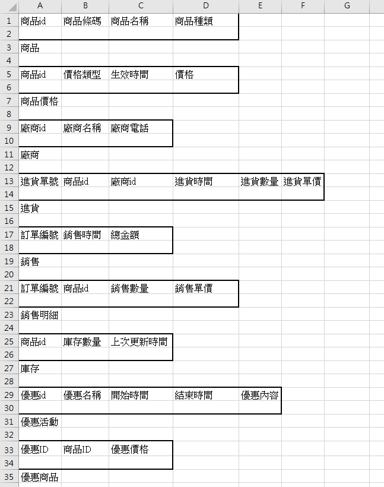

# 架構總覽（MVC 參考）

你的專案採用類似 MVC（Model-View-Controller）架構，主要分為三個層次：

## 1. Model（資料模型層）

- **位置**：`Repository\ProductDetails\*`  
- **內容**：
  - 負責資料結構的定義，例如：
    - 商品（`Product`）
    - 類型（`Category`）
    - 價格（`ProductPrice`）
    - 庫存（`Inventory`）
    - 供應商（`Supplier`）
    - 進貨（`Purchase`）
    - 銷售（`Sale`, `SaleDetail`）
  - 每個類別都封裝了對應的屬性與建構式，專注於資料本身的描述與儲存。

## 2. Controller（控制邏輯層）

- **位置**：`Controller\*`  
- **內容**：
  - 例如 `Config` 類別，負責應用程式設定與資料路徑管理。
  - 控制層負責協調 Model 與 View 之間的互動，處理業務邏輯與資料流。

## 3. View（視覺化介面層）

- **位置**：`UI\*`  
- **內容**：
  - 包含多個表單（Form），如：
    - `Desingener`
    - `AddSupplierForm`
    - `AddProductData`
    - `ReceivingForm`
  - 這些表單負責與使用者互動，顯示資料並接收輸入。
  - 主要以 WinForms/WPF 為基礎，透過事件（如按鈕點擊）觸發 Controller 的邏輯。

---

# 架構互動流程簡述

1. **使用者操作介面（View）**：  
   例如在 `Desingener` 主表單點擊「進貨」、「銷售」、「庫存」等按鈕。

2. **觸發控制邏輯（Controller）**：  
   事件處理函式（如 `BtnPurchase_Click`）會呼叫 Controller 層的邏輯，進行資料處理或存取。

3. **資料存取與處理（Model）**：  
   Controller 會操作 Model 層的物件，進行資料的新增、查詢、修改、刪除等操作。

4. **結果回饋至介面（View）**：  
   處理結果會回傳給 View，更新畫面或顯示訊息給使用者。

# 資料模組規劃

